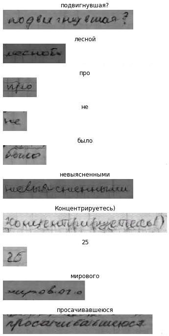

# ScrabbleGAN | RU
Russian ScrabbleGAN 
Модель ScrabbleGAN, обученная генерировать русские рукописные слова.

[Pretrained weights](https://drive.google.com/uc?export=download&confirm=no_antivirus&id=1iYAeqkphoWjk0Ci12T2gCV0xVunpDi_i)

[Char Map](https://drive.google.com/uc?export=download&confirm=no_antivirus&id=1APkTjkwDVWhcbZsIeC3J3A4HjeRJtLvQ)

[Lexicon](https://drive.google.com/uc?export=download&confirm=no_antivirus&id=1nH7dLbjHLQTcNHkGbc5dlZt5f0EQs-dh)

# Демо

